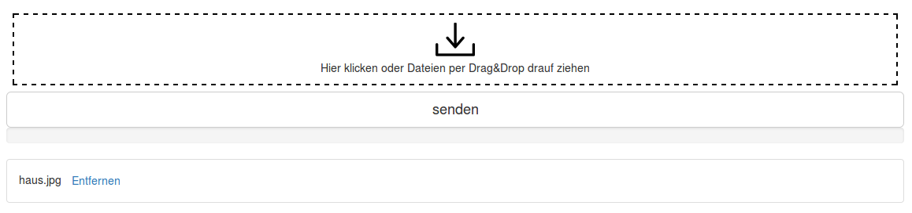

# jUpload

a simple Javascript file upload.



## Feature

- chunk split of files
- drag and drop support
- fallback to normal upload-form for older browsers
- supports: IE 11+, Firefox 13+, Chrome 20+, Opera 12+, Safari 6+

## Requires

- jQuery

## Example

```
<form id="form" action="server_normal.php" method="POST" enctype="multipart/form-data">
             <input name="file" id="uploadField" type="file" multiple />
              <div id="filezone">
                  DROPZONE
              </div>
              <button type="submit">submit</button>
</form>
```

```
<script type="text/javascript">
    u = new jUpload({
            upload_fild: "#uploadField",
            filezone: "#filezone",
            upload_on_submit: '#form',
            target: "server.php"
        });
    u.on("addedFile", function(file){
        console.log(file);
    });
    u.on("upload_end", function(){
        u.files = [];
    });
</script>
```

## Options

- **target**: url for commit to server
- **params**: optional parameters to send to Server
- **upload_field**: identifier for file-input
- **filezone**: identifier for upload-area
- **check_file**: function for file-validation (Size, Format, ...). Must return a boolean
- **upload_on_submit**: identifier of the wrapped form-tag: if upload should start on submit. (default: empty)
- **chunk_size**: byte-Size of chunks (default: 3 * 1024 * 1024 = 3MB)
- **abort**: boolean (default: false), can be used to abort during the update process

# Methods

- **init(opts)**: init the upload area 
- **on(eventName, func)**: registrate a eventlistener 
- **addFile(file)**: manually add a File-object
- **removeFile(uniqueName)**: remove File before upload by unique name
- **upload()**: start the upload 
- **files**: array of current files

## Events
- **unaviable**: called by init, if upload is completely not supported
- **aviable**: called by init, if upload available
- **drop_aviable**: called by init, if drag&drop available
- **drop_unaviable**: called by init, if drag&drop not available (but dropzone can by clicked to select file)
- **addFile_before**: (Param: file) called by select file, before add 
- **addedFile**: (Param: uploadFile) called after file added to files array
- **removedFiles**: (Param: [uploadFile]) remove file by unique Name
- **upload_before**: called by starting the upload
- **upload_end**:  called after finished upload
- **prozess**: (Params: bytes_total_size, uploaded_byte_size) called by updates in upload-prozess
- **file_uploaded**: (Param: uploadFile) called by each file if it is uploaded
- **file_prozess**: (Param: uploadFile, p ) called by each file when upload updates the upload-state (p is a float, between 0 and 1)
- **file_upload_response**: (Param: uploadFile, current_chunk_number, server_response) allow access to server response